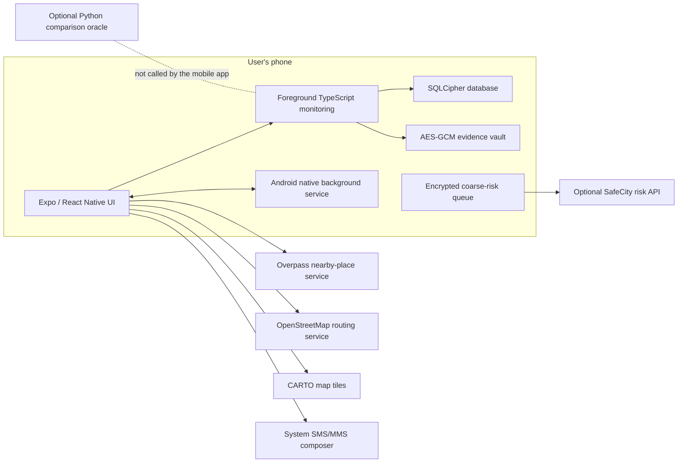
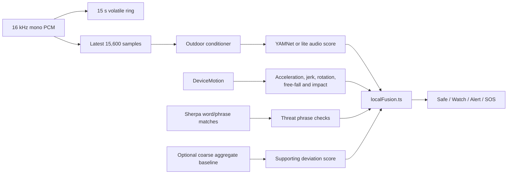
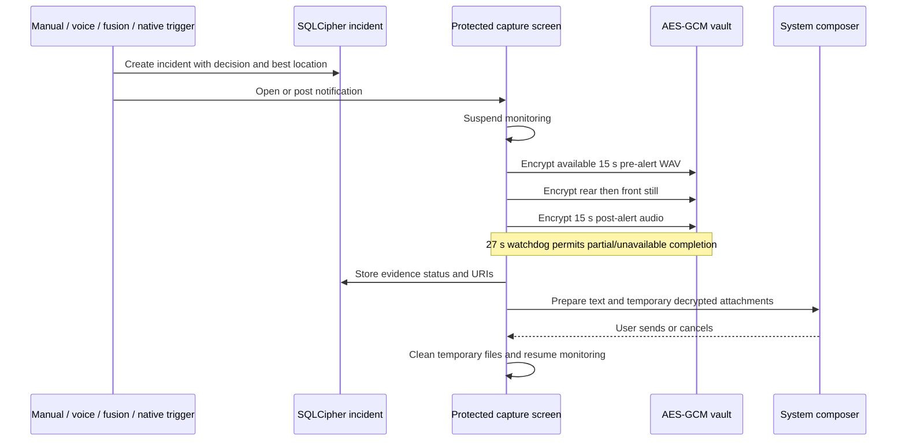
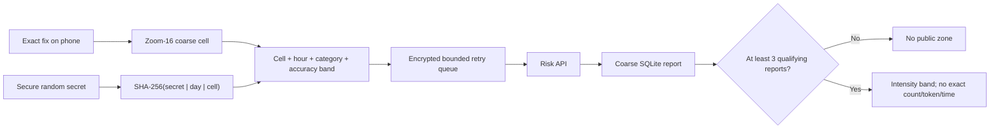

# SafeCity architecture

**Baseline:** source commit `2115fd4`, reviewed 25 July 2026
**Status:** safety-oriented prototype; not release-certified

This document describes the implementation as it exists. The most important boundary is that foreground mobile fusion, Android background protection, and the Python comparison oracle are three separate policy implementations.

## System context

The phone is the monitoring-inference and evidence-storage trust boundary. Ordinary microphone windows, motion windows, contacts, and incident evidence do not go to the Python service. Data does leave the phone for map functions, the system message composer, and the separately enabled anonymous risk feature; those flows are listed below.

## Runtime and platform matrix

| State | Active implementation | Audio | Motion | Behavior baseline | Automatic escalation |
| --- | --- | --- | --- | --- | --- |
| Android app active | TypeScript `MonitoringProvider` and `localFusion.ts` | YAMNet TFLite or lite features; Sherpa keyword spotter | Expo DeviceMotion features | Available when enabled | TypeScript multi-window fusion |
| Android app backgrounded/task removed | Native `SafeCityVoiceTriggerService` | Sherpa keywords plus conditioned-audio heuristic | Native fall/violent-motion rules | Not evaluated | Native confirmation rules and notifications |
| Android after reboot | Native receiver/service | Android 14+ requires a user-tapped notification before microphone use resumes | Motion may resume | Not evaluated | Native rules, subject to OS/vendor restrictions |
| iOS app active | TypeScript `MonitoringProvider` and `localFusion.ts` | Foreground audio pipeline | Expo DeviceMotion features | Available when enabled | TypeScript multi-window fusion |
| iOS app inactive/backgrounded | No equivalent native safety-monitoring service | React audio stream is stopped | React motion subscription is stopped | Not sampled | Equivalent continuous protection is not implemented |
| Python service | `service/app/detection/` | TensorFlow Hub YAMNet | Request metadata only | Not implemented | Comparison-oracle policy only |

Force-stopping the Android app stops its service and receivers until the user opens the app again. Battery restrictions and vendor task managers can interrupt foreground services.

## Foreground monitoring pipeline

- Normal foreground assessment cadence is approximately three seconds.
- Concerning motion temporarily shortens it to approximately 1.2 seconds.
- Android battery saver changes those intervals to approximately six and two seconds.
- Location is not refreshed for every inference window.
- Ordinary automatic SOS requires two recent confirmed multi-signal windows.
- Exceptional distress audio plus an ordered fall-impact sequence can escalate immediately.
- Audio alone or a single fall can request a check-in but cannot ordinarily open evidence automatically.
- Behavior deviation is supporting evidence only and is excluded from the independent-signal and automatic-SOS gates.
- Media playback, transport, and drop patterns suppress likely false positives.

The last eight fusion windows are session memory, not incident history. Ordinary audio and motion windows are not durably stored.

## Mobile components

| Component | Responsibility |
| --- | --- |
| `mobile/src/services/MonitoringProvider.tsx` | Session lifecycle, foreground PCM/motion ownership, cadence, health, fusion, app-state handoff, and SOS transition |
| `mobile/src/inference/onDeviceAudio.ts` | Model loading, waveform preparation, silence gating, YAMNet/lite scoring |
| `mobile/src/inference/safetyCalibration.ts` | Deterministic motion and outdoor-audio feature calibration |
| `mobile/src/inference/localFusion.ts` | Inspectable patterns, suppressors, temporal confirmation, hysteresis, cooldown |
| `mobile/src/inference/behaviorBaseline.ts` | Bounded coarse-cell/time/motion/speed aggregate learning |
| `mobile/src/services/voice-trigger.ts` | Bundled Sherpa model preparation and foreground keyword spotting |
| `mobile/modules/safecity-voice-trigger/` | Android native foreground service, restart behavior, notifications, native audio/motion rules |
| `mobile/src/db/DatabaseProvider.tsx` | SQLCipher key acquisition and database initialization |
| `mobile/src/db/repository.ts` | Settings, contacts, sessions, incidents, feedback, retention, and queue storage |
| `mobile/app/capture.tsx` | Pre-alert WAV, rear/front stills, post-alert audio, encryption, and partial-capture finalization |
| `mobile/src/services/evidenceVault.ts` | AES-GCM evidence encryption and temporary attachment decryption |
| `mobile/src/services/backgroundLocation.ts` | Latest location and OS background-location task |
| `mobile/src/services/riskZones.ts` | Coarse cell, hourly bucket, rotating token, bounded retry queue, risk-zone retrieval |
| `mobile/src/utils/safeRoute.ts` | Overpass facility/lighting lookup and walking route request |
| `mobile/src/components/SafetyMap.tsx` | CARTO tile requests and local route/zone rendering |

## SOS and evidence architecture

The app cannot silently send a message and does not treat an opened composer as delivery. Camera evidence is possible only while the protected capture screen is visible. Capture failures leave the incident intact and mark missing evidence explicitly.

## Durable data

The database key is a random 256-bit value stored in platform SecureStore. SQLCipher is keyed before migrations, with cipher memory security, secure deletion, foreign keys, and WAL enabled.

| Store | Contents |
| --- | --- |
| SQLCipher `settings` | Choices, versioned consent state, retention, cached translation packs |
| SQLCipher `contacts` | Emergency-contact name and number |
| SQLCipher `sessions` | Monitoring session state and timestamps |
| SQLCipher `incidents` | Trigger summary, optional exact incident location, evidence URIs/status, feedback and resolution |
| SQLCipher `anonymous_risk_queue` | Coarse unsent reports and retry metadata |
| SQLCipher baseline tables | Bounded coarse aggregate profiles and day markers |
| SecureStore | Database key, evidence key, risk-token secret, local identifiers/preferences |
| App-private files | AES-GCM encrypted incident evidence |
| Volatile memory | Current PCM ring, sensor windows, recent fusion history, keyword batches |

## Network and third-party data flows

| Action | Recipient | Data sent | Persistence in SafeCity |
| --- | --- | --- | --- |
| Open Safety Navigator | Overpass endpoint | Current exact coordinates inside a nearby-facility/lighting query | Response is screen state only |
| Select a mapped destination | `routing.openstreetmap.de` | Exact origin and destination coordinates | Route is screen state only |
| Render Safety Navigator map | CARTO basemap host | Tile coordinates plus normal network metadata such as IP address | Tiles are not written to incident history |
| Open incident location externally | Chosen mapping app/provider | Incident coordinates | Controlled by the external app |
| Prepare SOS message | System SMS/MMS composer | Contacts, message, location link, temporary evidence attachments | Messaging app may retain a draft or sent copy |
| Enable anonymous community risk reporting | Configured SafeCity risk API | Zoom-16 cell, hour bucket, trigger category, accuracy band, rotating cell/day token | Coarse queue retained locally until accepted/expired |
| Use device translation support | OS/translation implementation used by `expo-translate-text` | Depends on platform implementation | Cached translation pack may be stored locally |

Safety Navigator currently loads nearby places automatically on entry, not after a separate “load” action. This and the route/tile disclosures are audit findings in [AUDIT_REPORT.md](AUDIT_REPORT.md).

## Anonymous risk aggregation

Reports expire after at most 30 days by default. The server never receives exact GPS through this flow, but network infrastructure can still observe ordinary connection metadata. The mobile configuration currently accepts both HTTP and HTTPS URLs; production must enforce HTTPS.

## Python service boundary

The FastAPI service exposes:

- health, comparison analysis, comparison pattern, feedback, erasure, and metrics routes; and
- optional anonymous risk report/zone routes.

No route currently authenticates callers. Only the risk routes have process-local address-based rate limiting. The provided Compose configuration publishes port 8000 on every host interface. The container runs as a non-root user, disables privilege escalation, turns off Uvicorn access logs, and uses a bounded memory configuration, but a production deployment still requires TLS, ingress separation, authentication/authorization for private routes, and shared abuse controls. See [API_REFERENCE.md](API_REFERENCE.md).

## Failure behavior

| Failure | Current behavior |
| --- | --- |
| Foreground YAMNet fails | Lite/motion fallback; manual SOS remains |
| Microphone or motion unavailable after onboarding | Remaining lower-layer functions can degrade, but the root/onboarding gate currently requires every permission |
| Location cannot be refreshed during SOS | Incident is stored without a new location |
| Baseline disabled, warming, or inaccurate | Audio/motion/keyword rules remain; deviation contributes nothing |
| Keyword engine fails | Voice trigger reports an error; other trigger paths remain |
| Nearby-place or route request fails | No pins or route are fabricated; alternative search/112 controls remain |
| Anonymous risk API fails | SOS remains local; eligible coarse report stays in the bounded retry queue |
| Camera unavailable/backgrounded | Incident remains active; available evidence is retained and status becomes partial/unavailable |
| SMS/MMS unavailable or canceled | Incident remains local; no delivery claim is made |
| Android app task removed | Native service attempts to continue, subject to OS/vendor restrictions |
| Android app force-stopped | Background protection stops until the user reopens SafeCity |
| iOS app leaves active state | Foreground audio and motion stop; no equivalent persistent service takes over |

## Production boundary

SafeCity is not ready for a public safety claim or general release. The blocking evidence and remediation sequence are in [AUDIT_REPORT.md](AUDIT_REPORT.md). At minimum, a controlled pilot needs representative consented validation, supported-device background tests, battery/thermal measurements, security/privacy/accessibility/legal review, corrected permission and disclosure UX, hardened service ingress, completed operator/grievance details, release signing and rollback controls, and an audited delivery path.
