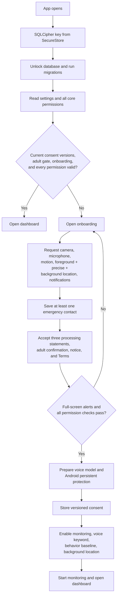
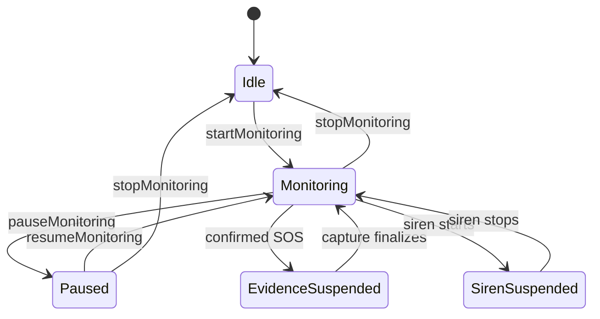
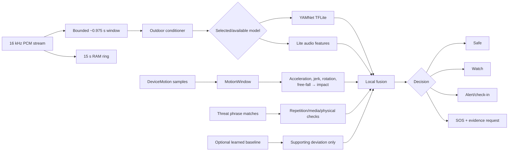
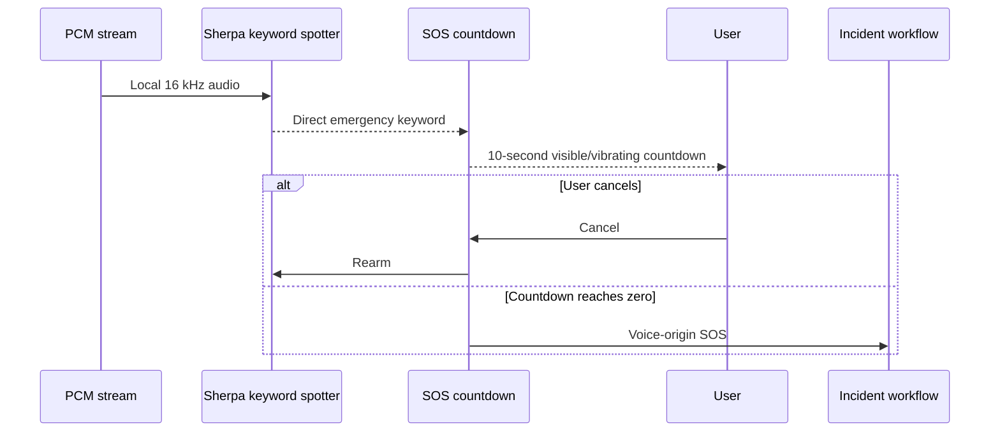
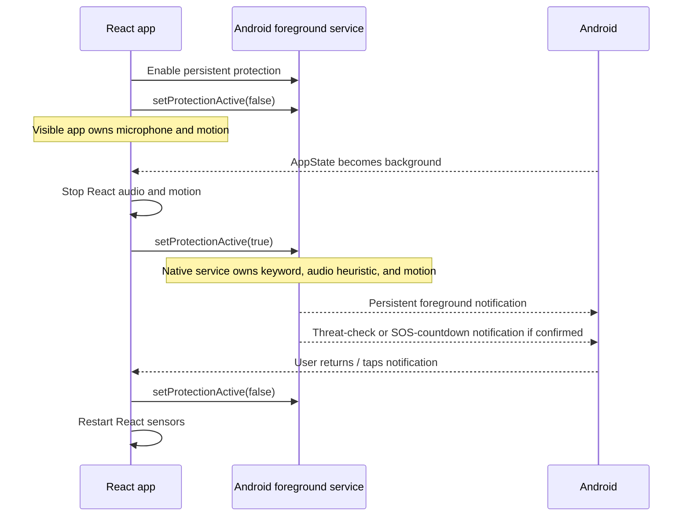
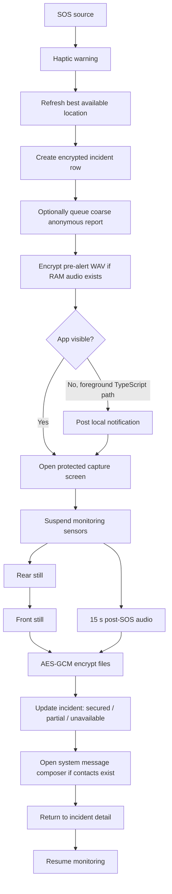
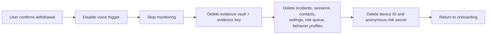
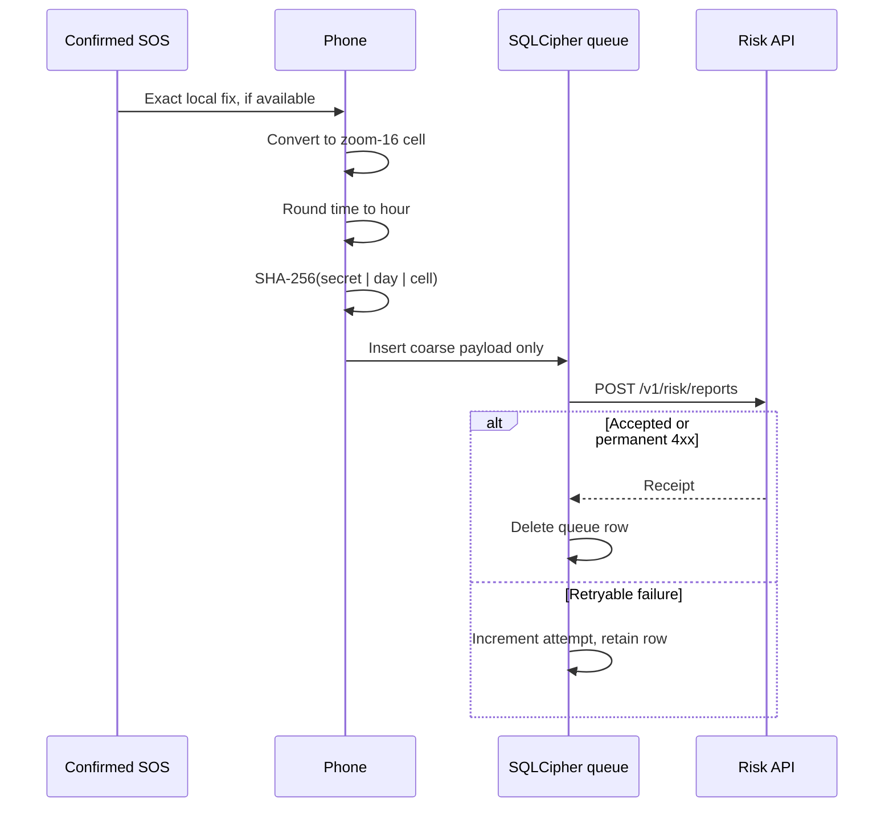
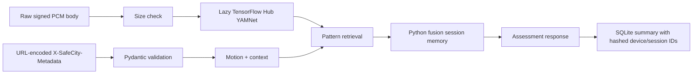

# SafeCity end-to-end workflows

**Baseline:** source commit `2115fd4`, reviewed 25 July 2026

This document traces current executable behavior. “Current” is important: it distinguishes the foreground TypeScript pipeline, Android native background pipeline, and Python comparison service.

## 1. First launch and onboarding

### Current gate

Onboarding completion requires every value in `PermissionSnapshot` to be true:

- camera;
- microphone;
- motion;
- foreground location;
- precise location;
- background location;
- notifications; and
- full-screen alerts.

The current flow does not permit onboarding into a degraded microphone-only, motion-only, no-camera, approximate-location, or foreground-only mode even though lower layers contain degraded behavior. This discrepancy is tracked in [AUDIT_REPORT.md](AUDIT_REPORT.md).

### Stored consent state

The app stores:

- processing-consent version and timestamp;
- privacy-notice version;
- Terms version and timestamp;
- adult confirmation;
- onboarding completion; and
- the settings enabled at completion.

When any required version changes, the root redirect sends the user back to onboarding.

## 2. Monitoring session lifecycle

### Start

`startMonitoring`:

1. re-reads current consent and settings;
2. synchronizes persistent voice state;
3. enables Android persistent protection;
4. creates a durable session record;
5. clears the RAM audio snapshot;
6. initializes and warms the selected audio model;
7. starts foreground audio and motion sensors;
8. refreshes location;
9. optionally starts background location; and
10. reports model/sensor health in transient Zustand state.

### Pause

Pause stops foreground sensors, Android persistent protection, and background location, marks the current session paused, and leaves the session identifier available for resume.

### Stop

Stop:

- deactivates sensors and background location;
- marks the session stopped;
- clears fusion session memory and RAM audio;
- resets current risk UI;
- disables Android persistent protection; and
- persists `monitoringEnabled: false`.

Ordinary inference windows are not written to incident history.

## 3. Foreground monitoring and fusion

### Cadence and buffering

- Audio: 16 kHz, mono, signed 16-bit PCM.
- YAMNet input: latest 15,600 samples, approximately 0.975 seconds.
- Normal foreground assessment: approximately every 3 seconds.
- Concerning motion: approximately every 1.2 seconds.
- Android battery saver: approximately every 6 seconds, or 2 seconds when motion is concerning.
- Voice batches: approximately 160 ms, bounded to four seconds pending.
- Pre-alert snapshot: latest 15 seconds in volatile memory.
- Location refresh: not per inference window; current and recent OS fixes are reused.

### Decision rules

- Time context can add at most a small bounded effect and cannot create a threat.
- Behavior deviation cannot count as an independent SOS signal.
- Ordinary automatic SOS requires two recent confirmed multi-signal windows.
- Persistent audio alone may reach Alert but cannot automatically open evidence.
- A single fall may reach Alert but cannot automatically open evidence.
- Exceptional high audio plus ordered fall-impact can escalate immediately.
- Media playback and drop/transport patterns suppress isolated evidence.
- A two-minute cooldown prevents duplicate incident capture.
- Alert-to-Safe transitions pass through Watch.

## 4. Direct emergency words and threat phrases

### Direct word

### Threat phrase

A threat phrase is not a direct emergency word:

1. the match is labeled using the reviewed English/Hindi/Bengali pilot catalog;
2. duplicate matches within three seconds are ignored;
3. eligible matches expire after 20 seconds;
4. at least two matches are required;
5. independent distress audio or motion must agree; and
6. likely media playback suppresses foreground confirmation.

Android background processing implements an equivalent high-level rule with native timing windows, not the TypeScript fusion function.

## 5. Android foreground/background ownership

### Task removal and restart

- Swiping away the Android task: `START_STICKY` and `onTaskRemoved` preserve the saved enabled choice where Android/vendor policy allows it.
- Process reclaim: the service restores saved state.
- Reboot/app update: boot receiver restores motion; Android 14+ requires one user tap before microphone service resume.
- Force-stop: service and receivers remain stopped until the app is opened.
- Battery-restricted/vendor modes may stop even a foreground service.

### iOS difference

The current app-state handler stops React microphone and motion processing whenever the app is not active. There is no iOS native equivalent to `SafeCityVoiceTriggerService`. Do not describe iOS as having Android-equivalent persistent protection.

## 6. Automatic or manual SOS

Automatic confirmation, manual long press, direct voice countdown, and native motion/audio countdown converge on an incident workflow.

### Capture constraints

- Camera capture requires the app's capture screen to be visible.
- Rear and front capture are sequential.
- Audio and photo operations use bounded timeouts.
- A 27-second watchdog finalizes partial/unavailable evidence if capture stalls.
- Exact location is refreshed independently and may update the incident.
- Capture failures do not delete the incident.
- The system composer may remain open until the user sends or cancels.

## 7. Messaging

The app builds a human-readable message containing:

- emergency warning;
- trigger summary;
- local incident time;
- Google Maps link when location exists;
- battery percentage when available;
- evidence status; and
- a request to call and contact emergency services.

The composer is addressed to every saved contact. Available encrypted evidence is temporarily decrypted for attachments. Android uses the local MMS module when multiple attachments are present and falls back to Expo SMS/MMS behavior.

SafeCity does not silently send a message and does not interpret an opened composer as delivery.

## 8. Incident review, retention, and deletion

### Incident review

History opens a SQLCipher-backed summary. The detail screen can:

- show decision score, factors, and model version;
- play pre-alert or post-SOS audio after temporary decryption;
- export encrypted `.safe` audio;
- reopen the system composer;
- open the incident coordinates in Google Maps;
- mark the incident resolved;
- record correct/false-alarm feedback; and
- delete the incident and encrypted evidence.

### Automatic retention

At app startup:

1. read the configured 1–90 day retention period;
2. list incidents older than the cutoff;
3. delete referenced evidence files;
4. delete incident rows; and
5. delete anonymous-risk queue rows older than 30 days.

Cleanup failure does not block the UI and is retried on the next launch.

### Consent withdrawal

Accepted anonymous risk reports cannot be installation-erased because the server intentionally does not retain a stable installation identifier; they expire under server retention.

## 9. Anonymous community risk zones

### Contribution

Preconditions:

- `EXPO_PUBLIC_RISK_API_BASE_URL` is configured;
- the user separately enables anonymous sharing;
- a location fix exists with accuracy no worse than 150 metres; and
- an SOS source reaches the reporting path.

Exact GPS is converted before the request body is built.

### Aggregation and read

1. API validates schema, cell, hour, age, and per-process rate limit.
2. SQLite inserts by rotating token with `INSERT OR IGNORE`.
3. Old reports are deleted on save.
4. A zone query uses a coarse-center bounding box.
5. The server filters cells by bbox and time.
6. Cells below the crowd threshold are omitted.
7. Remaining cells receive time-decayed intensity and broad risk band.
8. Public responses omit report counts, tokens, event times, and categories.

Risk zones are advisory map overlays. They do not trigger SOS and must not be described as proof that a route is safe or unsafe.

## 10. Safety Navigator and external data

Opening Safety Navigator currently:

1. requests/reads exact foreground location;
2. automatically sends that exact location to an Overpass endpoint in a 3 km query;
3. loads a route from the exact origin to the selected mapped destination;
4. requests CARTO tiles for the visible map area; and
5. optionally loads coarse SafeCity community risk zones.

The app does not store route history, but these network providers receive request metadata. Opening Google/Apple/device maps sends coordinates to that provider. The external-flow disclosure gap is documented in the audit.

## 11. Python comparison and risk API

### Comparison analyze workflow

This route is not called by the mobile app. It has no authentication or analyzer-specific rate limit and should remain isolated unless remediated.

### API lifecycle

- Service startup constructs settings, classifier, retriever, fusion state, SQLite stores, and optionally preloads YAMNet in a background task.
- `/health` distinguishes warming, ready, and degraded model state.
- `/docs` and `/openapi.json` are enabled.
- Uvicorn access logging is disabled in the supplied runtime command.
- The container runs as a non-root `safecity` user with `no-new-privileges` in Compose.

See [API_REFERENCE.md](API_REFERENCE.md) for the exact contract.
